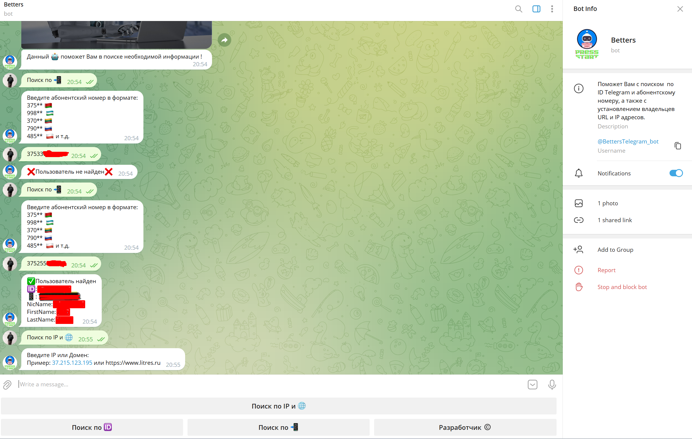

# BotsTelegramSpringOriginal
This software product will help you with the search by Telegram ID and subscriber number, as well as with the establishment of full data of URL and IP addresses. This bot is connected to a MySQL database, which contains user accounts that have access and a database of users (databases are obtained from open ists)

